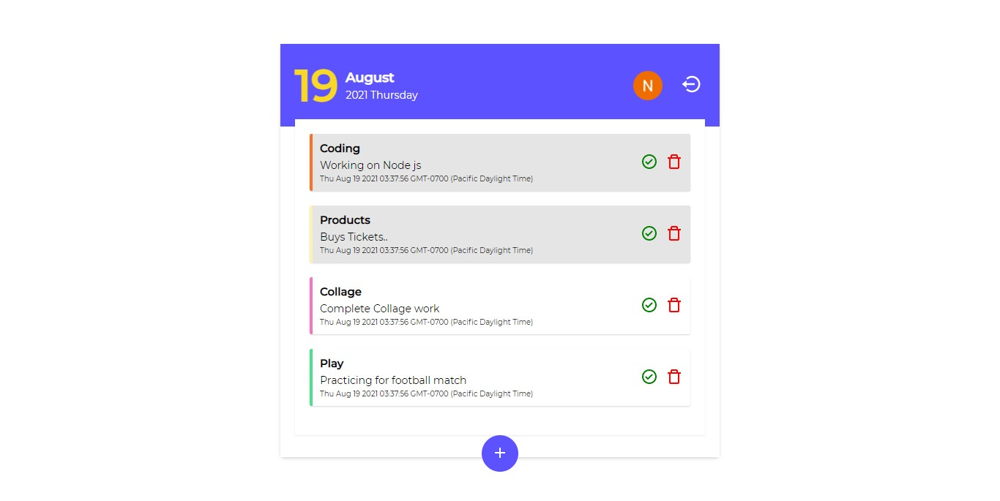

# Get started with todo app

# Usage

Install dependencies for both server and client

```
npm install
```

Run dev server to serving backend - http://localhost:8000

```
npm run dev
```

Run dev server to serving frontend - http://localhost:8000

```
npm start
```

# USER INTERFACE


